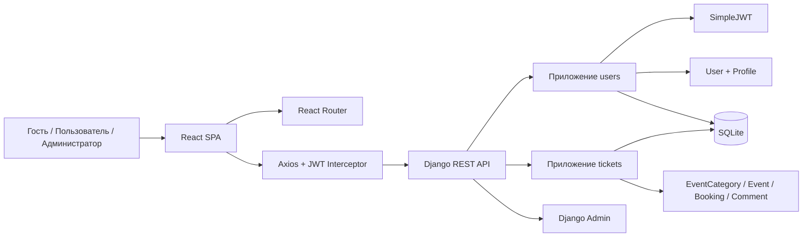

# Архитектура TicketFlow

## Диаграмма компонентов

## Логика разбиения

- `users` - отдельное приложение для регистрации, логина, JWT-аутентификации и профиля
- `tickets` - приложение предметной области для событий, бронирований, комментариев и категорий
- `React SPA` - клиентская часть с маршрутизацией, формами и работой с REST API

## Ограничение доступа

- `Гость` - только чтение опубликованных событий и категорий
- `Пользователь` - чтение публичных данных + создание бронирований, комментариев и управление своими событиями
- `Администратор` - полный контроль над категориями, событиями и пользователями через admin-panel

## Принятое отклонение от методички

По заданию пользователя модель БД выполнена **без нормализации**, чтобы хранить часть данных о площадке и организаторе прямо в сущности `Event`. Это намеренное архитектурное решение для курсовой версии проекта.
