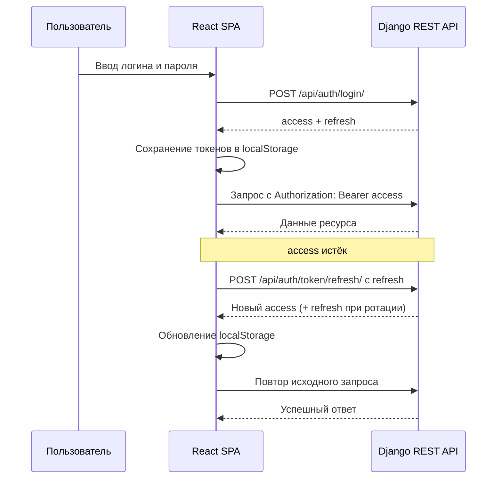

# Схема JWT-аутентификации

## Ключевые правила

- `access` используется для авторизации запросов
- `refresh` нужен для автоматического обновления `access`
- оба токена хранятся в `localStorage`
- если обновление не удалось, фронтенд очищает токены и завершает сессию
